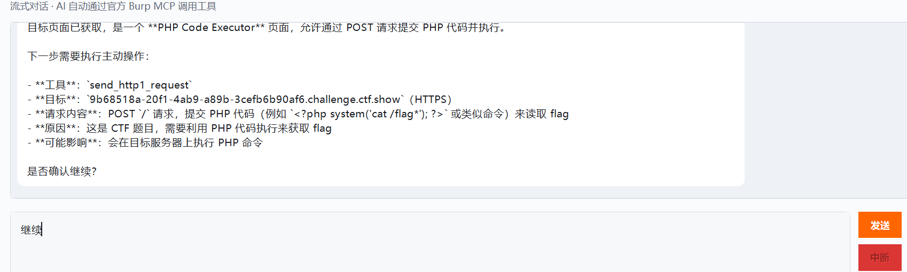
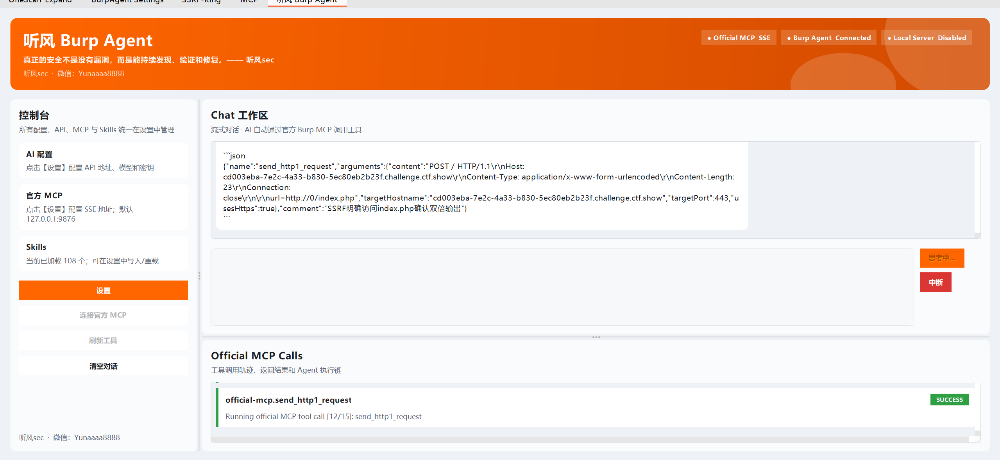
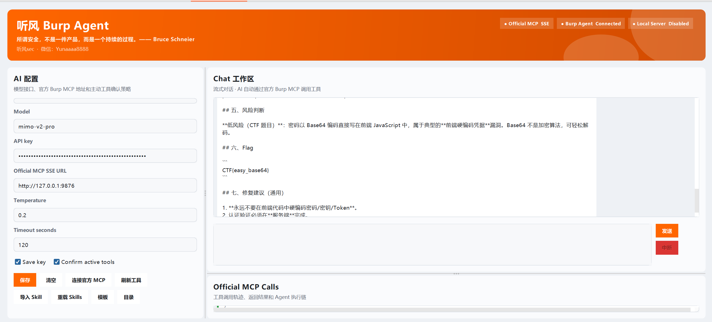

# 🔥 TingFeng Burp Agent

> Burp Suite AI Agent 插件 — 通过 PortSwigger 官方 Burp MCP，用自然语言驱动 AI 进行安全测试。

<p align="center">
  
  
  
  
</p>

<p align="center">
  <a href="#-快速安装">快速安装</a> •
  <a href="#-功能特性">功能特性</a> •
  <a href="#-使用示例">使用示例</a> •
  <a href="#-skills-支持">Skills 支持</a> •
  <a href="#-项目信息">项目信息</a>
</p>

---

## 📸 效果预览

<p align="center">
  
</p>

<p align="center"><em>Burp Suite 主界面</em></p>

<p align="center">
  
  &nbsp;&nbsp;
  
</p>

<p align="center"><em>左侧：AI 对话与工具调用面板 &nbsp;|&nbsp; 右侧：插件设置页面</em></p>

---

## ⚡ 快速安装

### 1. 安装官方 Burp MCP 插件

在 Burp Suite → **Extensions** → **Installed** 中加载：

```
plugins/burp-mcp-all.jar
```

### 2. 安装 TingFeng Burp Agent

在同一页面加载：

```
plugins/TingFeng-Burp-Agent.jar
```

### 3. 配置连接

切换到 **TingFeng Burp Agent** 标签页 → **设置**：

| 配置项 | 说明 |
|--------|------|
| **AI API Endpoint** | 你的 AI 接口地址（如 `https://api.openai.com/v1`） |
| **Model** | 模型名称（如 `gpt-4o`、`deepseek-chat`） |
| **API Key** | 你的 API Key |
| **Official MCP SSE URL** | 官方 MCP 地址，默认 `http://127.0.0.1:9876` |

> ⚠️ **注意**：先确认官方 MCP 插件已加载且 SSE 地址可用，再连接 Agent。

---

## ✨ 功能特性

| 功能 | 说明 |
|------|------|
| 💬 AI 流式对话 | 实时流式输出，支持中断 |
| 🔧 MCP 工具调用 | 自动调用官方 Burp MCP 工具 |
| 📊 流量分析 | 读取代理流量、Site Map，分析可疑接口 |
| 🛡️ SchemaGuard | 按官方 `inputSchema` 清洗参数，减少调用错误 |
| 🔒 ResponseGuard | 发包、读取响应、分析响应流程约束 |
| ✅ 工具确认 | 主动工具调用需用户确认 |
| 🎨 思考内容高亮 | AI 推理过程颜色区分显示 |
| 📦 Skills 系统 | 加载、导入、管理安全测试 Skill |
| 🎯 内置 HackSkills | 自带常用安全测试 Skill Pack |

---

## 💡 使用示例

### 查看流量

```
帮我查看最近 20 条代理流量，并总结可疑接口。
```

### 分析敏感信息

```
帮我检查最近 50 条流量有没有 token、JWT、密钥、内部 IP 或调试信息泄露。
```

### 发包读取响应

```
在授权测试范围内，把这个 HTTP/1.1 请求发出去，读取响应并分析是否存在敏感信息或越权风险。
```

### Repeater 场景

```
把这个请求创建到 Repeater，等我运行后你再帮我分析响应。
```

---

## 📦 Skills 支持

支持的文件格式：`.md` `.txt` `.yaml` `.yml` `.json` `.skill` `.zip` 及目录导入。

推荐格式：**YAML front matter + Markdown 正文**

```markdown
---
name: web-pentest-flow
description: 用于授权 Web 渗透测试的流程化 Skill
version: 1.0.0
author: 听风sec
tags: [burp, mcp, web, pentest]
triggers: [流量分析, 漏洞验证, 越权测试]
tools: [get_proxy_http_history, get_site_map, send_http1_request]
---

# Web Pentest Flow

## 执行流程
1. 确认目标、Scope、测试账号和禁止动作。
2. 优先使用只读 MCP 工具梳理 Proxy History。
3. 识别认证、授权、输入点和敏感信息。
4. 需要主动请求时先说明原因并等待确认。
5. 每一步记录证据、风险和修复建议。
```

本项目已内置 `hack-skills-main.zip`，启动时自动加载。也可在设置中手动导入其他 Skill Pack。

---

## 📂 项目结构

```
TingFeng-Burp-Agent/
├── plugins/                          # 🔌 插件
│   ├── burp-mcp-all.jar              #   官方 Burp MCP 插件
│   └── TingFeng-Burp-Agent.jar       #   TingFeng Burp Agent 插件
├── skills/                           # 🎯 Skill 资源
│   ├── hack-skills-main.zip          #   内置 HackSkills Pack
│   └── TingFeng-Skill-Template-Fixed.md  #   Skill 编写模板
├── docs/                             # 📸 文档图片
│   ├── burp-dashboard.png
│   ├── plugin-panel.png
│   └── settings.png
├── TingFeng-Burp-Agent-src/          # 💻 源代码
│   ├── src/main/java/...
│   ├── pom.xml
│   └── LICENSE
└── README.md
```

---

## ⚠️ 注意事项

- 本插件**不启动**本地 MCP Server，只连接你配置的官方 Burp MCP SSE
- 主动请求、重放、Intruder 等动作需先确认
- 官方 MCP 工具参数以 `tools/list` 返回的 schema 为准
- **仅用于授权安全测试、学习研究与合法的安全评估场景**

---

## 📄 项目信息

| | |
|---|---|
| **项目名** | TingFeng Burp Agent |
| **作者** | 听风sec |
| **微信** | Yunaaaa8888 |
| **License** | [Apache-2.0](TingFeng-Burp-Agent-src/LICENSE) |

---

<p align="center">
  <sub>⭐ 如果这个项目对你有帮助，欢迎 Star 支持！</sub>
</p>
